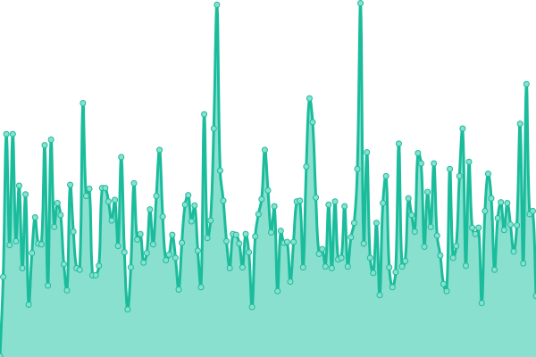
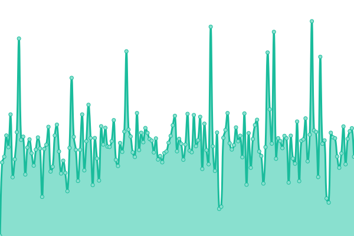
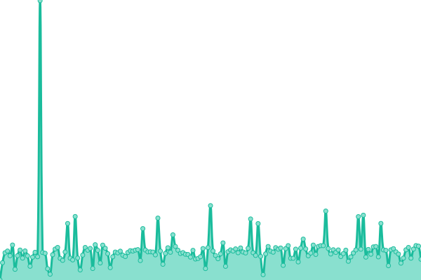
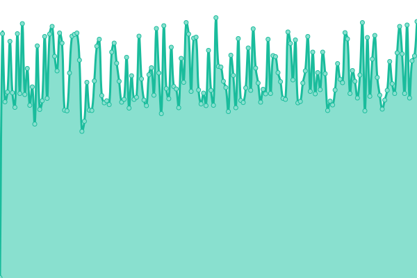
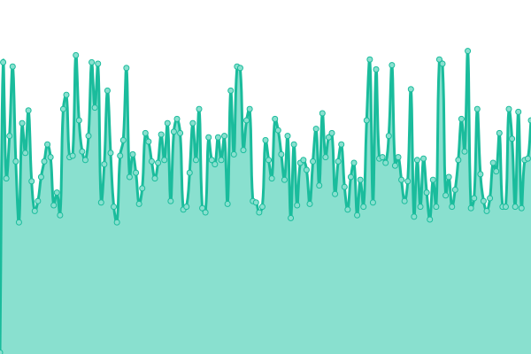
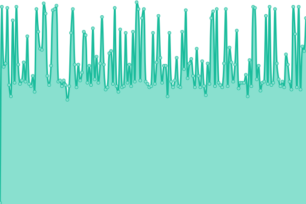
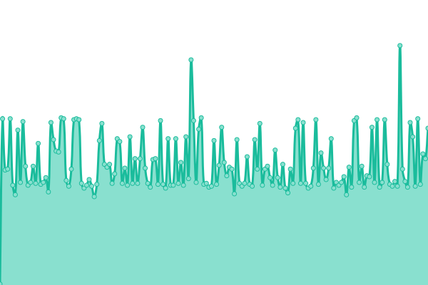
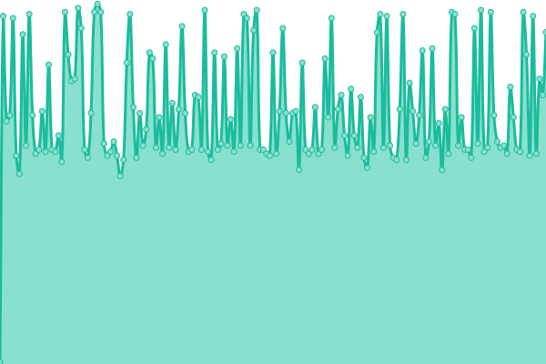

# [📈 Live Status](https://status.fowapps.com/): <!--live status--> **🟩 All systems operational**

<!--start: status pages-->
<!-- This summary is generated by Upptime (https://github.com/upptime/upptime) -->
<!-- Do not edit this manually, your changes will be overwritten -->
<!-- prettier-ignore -->
| URL | Status | History | Response Time | Uptime |
| --- | ------ | ------- | ------------- | ------ |
|  [Website (FowCRM.com)](https://fowcrm.com) | 🟩 Up | [website-fow-crm-com.yml](https://github.com/FowApps/upptime/commits/HEAD/history/website-fow-crm-com.yml) | 

 1842ms
     
 | 

<a href="https://status.fowapps.com/history/website-fow-crm-com">97.59%</a>
    

|  [FowAccess](https://access.fowapps.com) | 🟩 Up | [fow-access.yml](https://github.com/FowApps/upptime/commits/HEAD/history/fow-access.yml) | 

 772ms
     
 | 

<a href="https://status.fowapps.com/history/fow-access">100.00%</a>
    

|  [FowCRM](https://crm.fowapps.com) | 🟩 Up | [fow-crm.yml](https://github.com/FowApps/upptime/commits/HEAD/history/fow-crm.yml) | 

 171ms
     
 | 

<a href="https://status.fowapps.com/history/fow-crm">100.00%</a>
    

|  [FowDocs](https://docs.fowapps.com) | 🟩 Up | [fow-docs.yml](https://github.com/FowApps/upptime/commits/HEAD/history/fow-docs.yml) | 

 470ms
     
 | 

<a href="https://status.fowapps.com/history/fow-docs">100.00%</a>
    

|  [Developer Portal](https://developers.fowapps.com) | 🟩 Up | [developer-portal.yml](https://github.com/FowApps/upptime/commits/HEAD/history/developer-portal.yml) | 

 471ms
     
 | 

<a href="https://status.fowapps.com/history/developer-portal">100.00%</a>
    

|  [API Gateway](https://gateway.fowapps.com/health) | 🟩 Up | [api-gateway.yml](https://github.com/FowApps/upptime/commits/HEAD/history/api-gateway.yml) | 

 581ms
     
 | 

<a href="https://status.fowapps.com/history/api-gateway">100.00%</a>
    

|  [CRM API](https://gateway.fowapps.com/crm/health) | 🟩 Up | [crm-api.yml](https://github.com/FowApps/upptime/commits/HEAD/history/crm-api.yml) | 

 140ms
     
 | 

<a href="https://status.fowapps.com/history/crm-api">100.00%</a>
    

|  [Extension API](https://gateway.fowapps.com/extension/health) | 🟩 Up | [extension-api.yml](https://github.com/FowApps/upptime/commits/HEAD/history/extension-api.yml) | 

 126ms
     
 | 

<a href="https://status.fowapps.com/history/extension-api">100.00%</a>
    

|  [Mail API](https://gateway.fowapps.com/mail/health) | 🟩 Up | [mail-api.yml](https://github.com/FowApps/upptime/commits/HEAD/history/mail-api.yml) | 

 127ms
     
 | 

<a href="https://status.fowapps.com/history/mail-api">100.00%</a>
    

|  [Notification API](https://gateway.fowapps.com/notification/health) | 🟩 Up | [notification-api.yml](https://github.com/FowApps/upptime/commits/HEAD/history/notification-api.yml) | 

 126ms
     
 | 

<a href="https://status.fowapps.com/history/notification-api">100.00%</a>
    

<!--end: status pages-->

[**Visit our status website →**](https://status.fowapps.com/)

## 📄 License

- Powered by: [Upptime](https://github.com/upptime/upptime)
- Code: [MIT](./LICENSE) © [Upptime](https://upptime.js.org)
- Data in the `./history` directory: [Open Database License](https://opendatacommons.org/licenses/odbl/1-0/)
